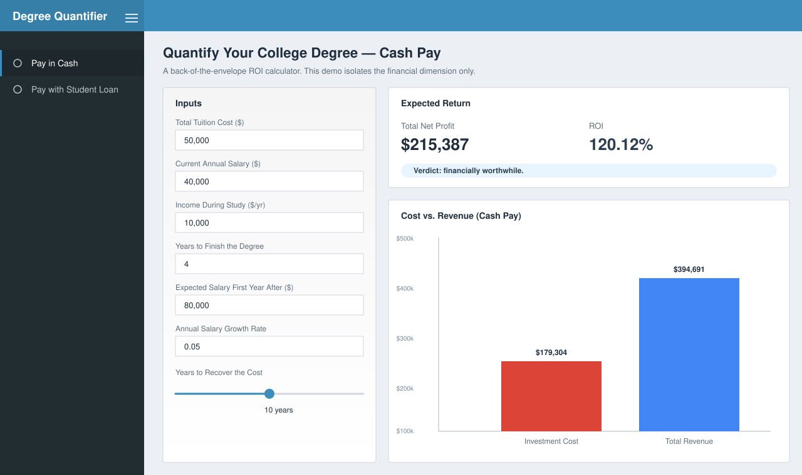

# Quantify Your Degree

> A back-of-the-envelope ROI calculator for U.S. college degrees, built with R and Shiny.

[](https://pingliao.shinyapps.io/Quantify_Your_Degree/)
[](https://www.r-project.org/)
[](https://shiny.posit.co/)
[](https://github.com/ping-liao/R-Shiny-App-2.0/actions/workflows/deploy.yml)
[](LICENSE)

**[Try the live app →](https://pingliao.shinyapps.io/Quantify_Your_Degree/)**



## Why this exists

Higher education in the U.S. is a major financial commitment. Whether a degree pays back depends on tuition, the wages a student gives up to attend, expected salary uplift after graduation, and — for the ~70% of students who borrow — interest costs over the life of a loan.

This app turns that decision into an interactive model. Adjust seven inputs, see the ROI update live, and compare cash-pay against student-loan financing side-by-side.

## Features

- **Two financing scenarios**, fully interactive: cash pay and student loan
- **Closed-form geometric-series formulas** (no iterative drift, no off-by-one bugs)
- **Standard amortizing-loan math** for monthly payment and total interest
- **At-a-glance verdict** plus a cost-vs-revenue bar chart
- **One-click deploy** to shinyapps.io via GitHub Actions on every push

## Methodology

Notation: `r` = annual salary growth rate, `D` = program duration (years), `Y` = post-graduation recovery horizon.

**Opportunity cost** during study, escalating each year:

```
opp_cost = (current_salary − income_during_study) × Σ_{j=0..D−1} (1 + r)^j
        = (current_salary − income_during_study) × ((1+r)^D − 1) / r
```

**Earnings uplift** over the post-graduation horizon:

```
uplift = (salary_after − current_salary × (1+r)^D) × ((1+r)^Y − 1) / r
```

**Loan total interest** uses standard monthly amortization:

```
m       = APR / 12
n       = 12 × term_years
payment = P × m / (1 − (1+m)^(−n))
total_interest = payment × n − P
```

**ROI** is `(revenue − cost) / cost × 100%`.

## Tech stack

| Layer | Choice |
|------|--------|
| Language | R 4.4 |
| UI / framework | `shiny`, `shinydashboard` |
| Hosting | shinyapps.io |
| CI/CD | GitHub Actions |

## Run locally

```r
install.packages(c("shiny", "shinydashboard"))
shiny::runApp("App.R")
```

Or from the command line:

```sh
Rscript -e 'shiny::runApp("App.R", launch.browser = TRUE)'
```

## Deployment

Every push to `main` triggers `.github/workflows/deploy.yml`, which provisions R 4.4, installs dependencies, and ships the app to shinyapps.io via `rsconnect`. The repo expects two secrets: `SHINYTOKEN` and `SHINYSECRET`.

## Project structure

```
.
├── App.R                          single-file Shiny app (UI + server + helpers)
├── docs/
│   └── screenshot.svg             README hero image
├── .github/workflows/deploy.yml   CI/CD to shinyapps.io
├── LICENSE
└── README.md
```

## Limitations and roadmap

The model is intentionally a starting point. It currently ignores:

- Field-of-study variance in post-graduation outcomes
- Time-value of money — there's no discount rate yet
- Tax effects on the salary delta
- Income-driven repayment, deferment, and forgiveness programs
- Inflation modeled separately from salary growth

**Planned**

- NPV / discount-rate input
- Pull post-graduation salary distributions from BLS / Census APIs
- Sensitivity analysis (tornado chart on the highest-leverage inputs)
- Compare multiple programs side-by-side

## License

[MIT](LICENSE) © Ping Liao